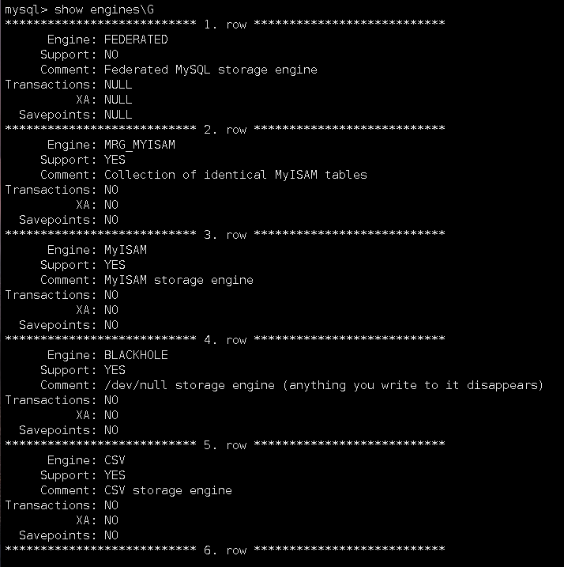

## 数据库

#### mysql 关系型数据库

```
特点:  持久保持在硬盘中数据(保存冷数据)
```

#### redis 非关系型数据库

```
特点:
去中心化
数据库槽点 进行数据迁移
工作在内存中， 保存热数据
```


# mysql数据库

mysql是一个开放源代码的数据库管理系统（DBMS）  

mysql被oracle收购了，是一个跨平台的数据库

```
	数据库是由一批数据构成的有序的集合，这些数据被存放在结构化的数据表里。 数据表之间互相关联，反应了客观事物间的本质练习。 数据库系统，提供对数据的安全控制和完整性控制。
	(数据库就是容器，用于持久化存储数据)
	(库是存放数据的地方，表是存储在库中指定的地方)

## 1.数据库定义

## 2 数据表的定义

## 3.数据类型
```


现在的oracle渐渐用的少了，用的多的是二开后的mysql。 

```
OceanBase(哦深呗死)     #阿里的海量存储数据库，比oracle强
```


mysql 8.0之前 只是一个关系型数据库（sql)

8.0之后，mysql 将非关系型数据库(nosql)融入了mysql

```
数据库数据全部存储在磁盘上
```


### 数据库的特点：

```python
#实现数据共享      
#减少数据冗余   (冗余，多余，减少多余的意思。同一个数据的多次调用不用写多个表)
#采用特定的数据类型  (例如int char varchar)
#具有较高的数据独立性  (每个表都是独立的)
#具有统一的数据控制功能 (所有表的操作格式都是相同的)
```


### 1. 关于数据表

```
	在关系数据库中，数据库的表是一系列二维数组的集合，用来存储数据和操作数据的逻辑结构。 它是由纵向的列和横向的行组成，行被称为记录，是组织数据的单位；列被称为字段，每一列表示记录的一个属性，都有相应的描述信息
```

### 2.数据类型

```
数据类型决定了数据在计算机中的存储格式，代表不同的信息类型。 
```

### 3.主键

```python
#唯一的标识表中的记录，可以定义表中的一列或多列为主键。 
#主键列上不能有两行相同的值，也不能为空值(NULL)


#使用场景，例如身份证号，必须有值，而且不能为空，而且唯一
#什么是多列添加主键
当没有办法对一个字段的唯一性时， 将多列设置为主键，就能进行对比
比如
字段1 字段2  子段3
a	  b      c
a	  b      d
这样来进行区分


空值的常见场景：
预先不写入值的字段，如死亡日期。     ##字段特征，当写入这个字段的时候必须要有数据，但是又不能去 填写数据，就要有一个null空值来占位
```

### 4.数据库技术构成

```
	数据库系统由硬件部分和软件部分共同构成，硬件主要用于存储数据库中的数据，包括计算机、存储设备等。 软件部分则主要包括DBMS、支持DBMS运行的操作系统，以及支持多种语言进行应用开发的访问技术等
```


### 5.数据库主要构成部件

```python
#数据库  存储数据的地方  (仓库)
#数据库管理系统： 将数据库和表存入到仓库
#数据库应用程序： 对数据库和表的增删改查
```

### 6.数据库系统的存储过程

```python
#用户--》应用程序--->数据库管理系统-->操作系统-->硬件
```


## 2. sql语言

```python
SQL-92  ANSI 美国标准机构

分为4类:

'数据定义语言(ddl): create(磕睿特）(创建) alter(爱哦特儿)(修改) drop(罩破）(删除)'
                       #针对数据库或数据表而言
'数据操作语言(dml):  insert(因涩特儿）(写入) update(更新) delete(删除)'
    				 #针对表中的数据而言

'数据查询语言(dql): select(查询) '    #查看表中数据

'数据控制语言(dcl): begin(比哏)(开启事务) grant(戈ruan特）(授权) commit(磕幂特)(提交事务) revoke(睿我磕)(收回权限)' 
    							#对于用户或者功能的控制情况
```


#### 1.  ddl 案例

```mysql
#创建库
create database sjk1223;

#切换库
use sjk1223;

#窗口表
create table student (name varchar(30),\
                      sex char(2),\
                      high int,\
                      weight int,\
                      address varchar(50),\
                      PRIMARY KEY(name,sex,high,weight,address));
					#PRIMARY KEY 设置主键
#给表插入数据
insert into student VALUES('zs','m','180','80','bjhd');
insert into student VALUES('lisi','m','180','80','bjhd');
```

查看表

```mysql
show tabels;    #查看当前库的表
select * from student;   #查看student表中的数据
drop table student;     #删除表
```


### 关于其他应用程序去连接数据库

```
1. ODBC:   开放数据库互联   ODBC技术为访问不同的sql数据库提供了一个共同的接口，
2  JDBC:   java连接数据库，是一种用于执行sql语句的java API，可以为多种关系数据库的提供统一访问。 java编写的接口
3. ADO.NET:    在windows微软上的数据库接口
4. PDO:   PDO  为PHP访问数据定义了一个轻量级、一致性的接口，它提供了一个数据访问抽象层，这样，无论使用什么数据库，都可以通过一致的函数执行查询和获取数据。PDO是php 5 新加入的一个重大功能
```


#### 2.什么是mysql

```
mysql是一个小型数据库管理系统，与其他大型数据库股那里系统例如: oracle、DB2 SQL server等相比，mysql 规模小，功能有限，但是体积小、速度快、成本低，且它提供的功能相对复杂
```


#### 3. 关于客户端和服务段

```mysql
systemctl restart mysqld    #启动的是服务端

mysql -u root -p123.com    #使用客户端连接数据库
```

#### 4 查看mysql版本

```mysql
select version();
```

#### 5. mysql的社区版和企业版本

```
社区版:      完全免费，但官方不提供技术支持
企业版:     提供技术支持，和完整的服务

版本号结构
5  主版本号，描述文件格式，所有版本5的发行版都有相同的文件各式
5  是发行级别，主版本和发行级别组成在一起便构成了发行序列号
36   是在此发行系列的版本号，虽则每次发布版本递增，通常选择已经发行的最新版本(修复版本bug)
```

#### 6 mysql的优势

```mysql
1.速度快  (相对于大型的数据库(sql server oracle等)来说启动快)
2.免费    
3. 操作简单，使用容易
4. 移植性强(跨平台)
5. 接口丰富(当前所有的主流语言都可以于mysql沟通，拥有API接口)
6.安全性和连续性


安全性
mysql有默认 存放有root用户的信息，所以才能用root去登陆
mysql 连接数据库时，是通过tcp去来连接，在发送之前将密码哈希加密，是不可逆性的，无法通过哈希值反向破解密码

#查看user表中记录的权限
select * from mysql.user where user='root' and host='localhost' \G;


密码暴力破解
撞库，我们很多软件的密码都是一样的，只要破解了一个就会拿一个号去试
```

#### 7  常用命令：

```mysql
#创建数据库
create database 数据库名

#切换所在的数据库
use 数据库名


#mysql的结束符
在mysql中默认使用;(分号)作为结束符用于结束mysql命令
结束符还有\G和\g  
其中\g等同于;(分号), \G使用更直观的方式进行查看内容，去掉表结构的方式

#更改结束符
```

#查看当前mysql中有那些数据库

```
show databases;
```

数据库默认有4个库 (土著数据库)

```mysql
information_schema        #用于保存关于mysql所维护的所有数据库的信息(包含数据库名，库中的表名，表中的字段，数据类型等消息)  （信息库）

mysql                     #用于保存数据库中用户信息，权限关键字等内容

performance_schema        #用于收集服务器性能参数，5.5版本之后才拥有的数据库

test                      #测试库，任何用户在该库中都拥有root权限，可增删改查
```


#### 8.删除数据库

```sql
drop database 数据库名
#数据库一旦被删除，在库中的所有的表以及表中的数据都随数据库的删除而删除
```


#### 9.存储引擎

```
属于mysql低层组件，通过存储引擎支持mysql的增删改查，不同的存储引擎拥有不同的功能，属于mysql的核心
```

查看存储引擎的语法

```sql
show engines\G    #去掉表结构去查看\G
```




常用的存储引擎

```
1.MyISAM  (麦ISAM) 
2.innoDB  (因NO 地B)
3.Memory  (麦么睿)
```

##### 存储引擎的含义

```mysql
      Engine: MyISAM       #存储引擎的名称
     Support: YES			#mysql是否支持该种引擎
     Comment: MyISAM storage engine 	#mysql对改引擎的描述
Transactions: NO			#是否支持事务
          XA: NO			#是否支持分布式事务
  Savepoints: NO			#是否支持事务的保存点
  
  #存储引擎就是mysql存储数据的格式，不同的存储引擎有的支持全文索引，有的支持外键，需要根据不同的环境选择适当存储引擎进行使用
```

##### 注意:

```python
存储引擎是针对表来说的，一个表有一个存储引擎


#3个不允许
'''
在MySQL中不允许出现相同名字的数据库

在库中不允许出现相同名字的表

在表中不允许出现相同名字的字段
'''


#在mysql中，对于库名、表名有严格的大小写区分，但是对于字段没有严格的区别
```

###### 

#### 10 常用的存储引擎

###### 1. MyISAM存储引擎

```python
1. Mysql5.5版本之前默认的存储引擎(建表如果不指定存储引擎默认使用MyISAM),在5.5之后使用innoDBB
2. myisam 存储引擎读取速度快，占用资源少，不支持事务，不支持外键，支持全文索引   (索引=目录)
3. 读写相互阻塞  (读写不能同时进行)
4. 只能缓存索引不能缓存数据  (短时间记录目录，但不记录数据)

'''
总结: 使用场景
1.不需要事务的业务
2.适用于读数据较多的业务 (读取效率高)
3.并发较低的业务
4.硬件资源较差的服务器 (避免硬件存储资源不足)
'''
事务= 任何与钱有关
```

未完