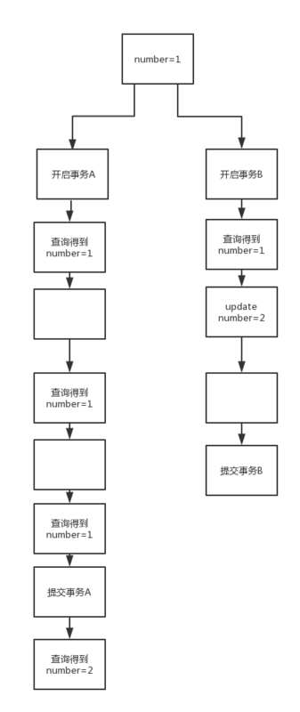

# 事务

事务: 多条sql语句的集合，要么都成功，要么都失败，为了保证执行的语句符合下面四个标准

```mysql
 #MySQL 事务主要用于处理操作量大，复杂度高的数据。比如说，在人员管理系统中，你删除一个人员，你既需要删除人员的基本资料，也要删除和该人员相关的信息，如信箱，文章等等，这样，这些数据库操作语句就构成一个事务！

   # 在 MySQL 中只有使用了 Innodb 数据库引擎的数据库或表才支持事务。
    #事务处理可以用来维护数据库的完整性，保证成批的 SQL 语句要么全部执行，要么全部不执行。
    事务用来管理 insert,update,delete 语句
```


## #acid特性0

### a    原子性 (atomicity) 	   

```mysql
 #一个事务必须被称为一个不可分割的单元
 
 #一个事务（transaction）中的所有操作，要么全部完成，要么全部不完成，不会结束在中间某个环节。事务在执行过程中发生错误，会被回滚（Rollback）到事务开始前的状态，就像这个事务从来没有执行过一样。
```


### c    一致性 (consistency)  

```mysql
  #数据库从一种状态切换到另一种状态
  
  #在事务开始之前和事务结束以后，数据库的完整性没有被破坏。这表示写入的资料必须完全符合所有的预设规则，这包含资料的精确度、串联性以及后续数据库可以自发性地完成预定的工作。
```


### i    隔离性(isolation) 	   

```mysql
#事务提交前，对其他事务不可见

#数据库允许多个并发事务同时对其数据进行读写和修改的能力，隔离性可以防止多个事务并发执行时由于交叉执行而导致数据的不一致。事务隔离分为不同级别，
包括
读未提交（Read uncommitted）
读提交（read committed）
可重复读（repeatable read）
串行化（Serializable）
```


### d    持久性(durablity)	   

```mysql
 #一旦事务提交,所有修改的内容永久保存到数据库中
 #事务处理结束后，对数据的修改就是永久的，即便系统故障也不会丢失
```

### 注意

```mysql
     在 MySQL 命令行的默认设置下，事务都是自动提交的，即执行 SQL 语句后就会马上执行 COMMIT 操作。因此要显式地开启一个事务务须使用命令 BEGIN 或 START TRANSACTION，或者执行命令 SET AUTOCOMMIT=0，用来禁止使用当前会话的自动提交。
```


## 模拟一个事务

```mysql
create database sw;

 use sw;


create table bank
    (name varchar(30),
    money decimal(8,2));


mysql> insert into bank values ('yb',10),('fg',10000);

mysql> select * from bank;
+------+----------+
| name | money    |
+------+----------+
| yb   |    10.00 |
| fg   | 10000.00 |
+------+----------+
2 rows in set (0.00 sec)
```


## #事务的控制语句

```mysql

	#开启事务
    BEGIN 或 START TRANSACTION 显式地开启一个事务；
	
	#提交事务
    COMMIT 也可以使用 COMMIT WORK，不过二者是等价的。COMMIT 会提交事务，并使已对数据库进行的所有修改成为永久性的；
	
	#回滚事务
    ROLLBACK 也可以使用 ROLLBACK WORK，不过二者是等价的。回滚会结束用户的事务，并撤销正在进行的所有未提交的修改；
	
	#设置事务保存点
    SAVEPOINT identifier，SAVEPOINT 允许在事务中创建一个保存点，一个事务中可以有多个 SAVEPOINT；

	#清除一个事务保存点
    RELEASE SAVEPOINT identifier 删除一个事务的保存点，当没有指定的保存点时，执行该语句会抛出一个异常；

	#指定回滚位置
    ROLLBACK TO identifier 把事务回滚到标记点；

	#设置事务隔离级别
    SET TRANSACTION 用来设置事务的隔离级别。
    
    InnoDB 存储引擎提供事务的隔离级别有
    READ UNCOMMITTED、
    READ COMMITTED、
    REPEATABLE READ 
    SERIALIZABLE。

```

### MYSQL 事务处理主要有两种方法：

```mysql


1、用 BEGIN, ROLLBACK, COMMIT来实现

    BEGIN 开始一个事务
    ROLLBACK 事务回滚
    COMMIT 事务确认

2、直接用 SET 来改变 MySQL 的自动提交模式:

    SET AUTOCOMMIT=0 禁止自动提交
    SET AUTOCOMMIT=1 开启自动提交
```


## 案例

```mysql
begin                          #开启事务


#发贵在银行的钱少了10000
update bank set money=money-10000 where name='fg';


#云博银行的钱+了10000
update bank set money=money+10000 where name='yb';


#查询两人的钱
mysql> select * from bank;
+------+----------+
| name | money    |
+------+----------+
| yb   | 10010.00 |
| fg   |     0.00 |
+------+----------+


#银行接到信息，说发贵被抢了，本次转账无效，执行回滚操作
rollback;


#回滚后数据还原
mysql> select * from bank;
+------+----------+
| name | money    |
+------+----------+
| yb   |    10.00 |
| fg   | 10000.00 |
+------+----------+

#提交事务
commit;			 
```


### #查看事务当前的自动提交状态

```mysql
mysql> show variables like 'autocommit';
+---------------+-------+
| Variable_name | Value |
+---------------+-------+
| autocommit    | ON    |
+---------------+-------+
1 row in set (0.00 sec)
```

### 案例2（事务自动提交）

```mysql
mysql> begin;
Query OK, 0 rows affected (0.00 sec)

mysql> update bank set money=money-1000 where name='fg';
Query OK, 1 row affected (0.00 sec)
Rows matched: 1  Changed: 1  Warnings: 0

mysql> update bank set money=money+1000 where name='yb';
Query OK, 1 row affected (0.00 sec)
Rows matched: 1  Changed: 1  Warnings: 0


#这时不要提交，在打一次begin
begin;
Query OK, 0 rows affected (0.01 sec)

#发现上一次的事务已经自动提交了
mysql> select * from bank;
+------+---------+
| name | money   |
+------+---------+
| yb   | 1010.00 |
| fg   | 9000.00 |
+------+---------+
2 rows in set (0.00 sec)


```


## 事务的隔离性 由隔离级别决定

```mysql
1. 未提交读 read uncommitted
	#脏读: 事务在未提交前对其他事务是可见的,用于测试环境使用，生产环境是不允许使用的
	#幻读: 数据存在但是看不到,相当有产生幻觉
2. 已提交读 read committed
	#解决脏读问题
	#不可重复读
	#幻读问题
	
3. 可重复读 repeatable read
	#无脏读
	#解决不可重复问题
	#幻读问题依然存在
	
4. 可串行读 serializable
	#将事务进行排序逐一执行,属于级别最高的隔离级别
	#解决了所以的问题，但是效率降低
	
	1 #读锁: 共享锁,s锁,如果一个事务T对表A添加读锁，那么其他用户对于该表可以继续添加读锁，但是不能添加写锁，直到事务T释放对A的加锁
	（select)  加锁 就相当于，我不能解锁，但是我能加锁
	#读锁表示，能读不能写（select）

	2 #写锁: 也叫排它锁，x锁，如果一个事务T 对于表A添加写锁，那么其他事务对于表A不能添加任何锁，直到事务T释放对A的加锁
	(update insert)  解锁
	
	#既不能读，也不能写，只有自己能用
	
	3 #表锁: 操作对象是数据表,相当有向整个表锁住,开销小,但并发低（myisam)
	4 #行级锁: 操作对象为表中某行，运用mvcc机制，开销大，但并发高(innodb)  
		#mvcc: 多版本并发控制，在表锁 和行锁之上，结合该机制，可以处理更高的并发，开销最大，并发最高。相当有锁机制的妥协，可以允许多个锁并存，并且锁之间不会互相阻塞。
```


### 1. 未提交读 read uncommitted

```mysql
mysql> create table student
        (id int not null auto_increment,
        name varchar(30) not null,
        grade decimal(5,2),
        primary key(id));
Query OK, 0 rows affected (0.01 sec)

#模拟两个用户 开启两个终端,两个客户端

用户1,用户2
use sw

#两边客户端都设置隔离级别为  ‘未提交读’
set session tx_isolation='read-uncommitted';
#两边同时开启事务
begin;


###############################################################

#终端1
#插入数据
insert into student(name) values ('user1');

#终端2
查看数据

mysql> select * from student;
+----+-------+-------+
| id | name  | grade |
+----+-------+-------+
|  1 | user1 |  NULL |
+----+-------+-------+
1 row in set (0.00 sec)
#未提交读， 
#脏读: 事务在未提交前对其他事务是可见的

```

##### 版本问题解决

```mysql
5.5版本会无法设置未提交读 需要设置点东西

mysql> show variables like '%binlog_format%';
+---------------+-----------+
| Variable_name | Value     |
+---------------+-----------+
| binlog_format | STATEMENT |
+---------------+-----------+
1 row in set (0.00 sec)

#解决方法
set binlog_format_mixed;
```

### 2     已提交读

```mysql
#先将两边终端的事务都提交
commit;

#两边终端都设置为已提交读
set session tx_isolation='read-committed';
#开启事务
begin

#插入数据(终端1)
insert into student(name) values('yb');

#终端2     是无法查看到,因为是提交后可查看
mysql> select * from student;
+----+-------+-------+
| id | name  | grade |
+----+-------+-------+
|  1 | user1 |  NULL |
+----+-------+-------+
1 row in set (0.00 sec)

#解决了藏读的问题
#不可重复读
#幻读问题依然存在

#终端1 提交
commit

#终端2  查看
mysql> select * from student;
+----+-------+-------+
| id | name  | grade |
+----+-------+-------+
|  1 | user1 |  NULL |
|  2 | yb    |  NULL |
+----+-------+-------+
2 rows in set (0.00 sec)
```

### 3 可重复读 

```mysql
#提交两终端事务
commit;

#两终端设置 隔离级别为(可重复读 )
set session tx_isolation='repeatable-read';
begin;  #开启事务

#查询两个终端中的表值
#表1
select * from student;
+----+-------+-------+
| id | name  | grade |
+----+-------+-------+
|  1 | user1 |  NULL |
|  2 | yb    |  NULL |
+----+-------+-------+
8 rows in set (0.00 sec)


#表2 查询
mysql> select * from student;
+----+-------+-------+
| id | name  | grade |
+----+-------+-------+
|  1 | user1 |  NULL |
|  2 | yb    |  NULL |
+----+-------+-------+
8 rows in set (0.00 sec)


#终端1 插入数据(这里我们使用了插入数据或者update，也就是写锁，当我没有提交数据之前，其他用户是无法进行数据查询的) #不提交事务
insert into student(name) values('zg');


#终端1查看
mysql>  select * from student;
+----+-------+-------+
| id | name  | grade |
+----+-------+-------+
|  1 | user1 |  NULL |
|  2 | yb    |  NULL |
|  3 | zg    |  NULL |
+----+-------+-------+
10 rows in set (0.00 sec)


#终端2 查看
 select * from student;
+----+-------+-------+
| id | name  | grade |
+----+-------+-------+
|  1 | user1 |  NULL |
|  2 | yb    |  NULL |
+----+-------+-------+
2 rows in set (0.00 sec)

#发现终端2的数据并没有被修改


#提交终端1的事务
commit;


#终端2 依然查看不到
mysql> select * from student;
+----+-------+-------+
| id | name  | grade |
+----+-------+-------+
|  1 | user1 |  NULL |
|  2 | yb    |  NULL |
+----+-------+-------+
2 rows in set (0.00 sec)


#为什么终端2上查不到 数据，因为它没有更新，
#提交 终端2的事务

#查看
mysql> select * from student;
+----+-------+-------+
| id | name  | grade |
+----+-------+-------+
|  1 | user1 |  NULL |
|  2 | yb    |  NULL |
|  3 | zg    |  NULL |
+----+-------+-------+
3 rows in set (0.00 sec)
#只要你不再事务里面你就可以看到
```



### 4  可串行化

```mysql
可串行化——SERIALIZABLE
  #事务的最高级别，在每个读的数据行上，加上锁，使之不可能相互冲突，因此，会导致大量的超时现象
```

案例

```mysql
#提交
commit;

#终端1
select * from student;

#设置隔离级别(终端1,终端2)
set session tx_isolation='serializable';
begin;


#终端1插入数据xx
insert into student(name) values('xx');

#终端1查看数据
mysql> select * from student;
+----+-------+-------+
| id | name  | grade |
+----+-------+-------+
|  1 | user1 |  NULL |
|  2 | yb    |  NULL |
|  3 | zg    |  NULL |
|  4 | xx    |  NULL |
+----+-------+-------+
4 rows in set (0.00 sec)


#终端2查看数据
mysql> select * from student;
#发现阻塞不动了，它排序了
#终端1提交后，终端2可以查看了
commit;

```

案例2

```mysql
可串行化事务 serializable 是事务的最高级别，在每个读数据上加上锁

比如A事务使用了 serializable 隔离级别，只查询数据，那么B事务这个时候如果要update相同数据，则必须等待A事务完成。
串行化事务中，读锁被获取后，写锁需要等待

```


### 3  查看当前隔离级别

```mysql
mysql> select @@tx_isolation;
+----------------+
| @@tx_isolation |
+----------------+
| READ-COMMITTED |       #当前隔离级别
+----------------+
1 row in set (0.00 sec)

```

