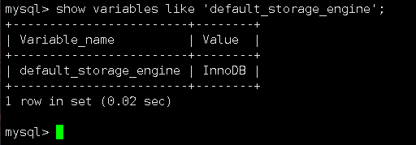
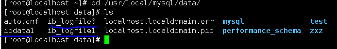
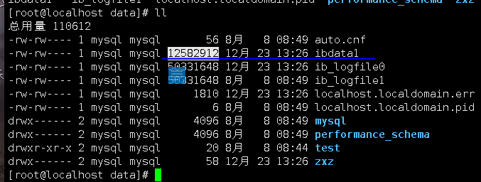

存储引擎，续


## 2.innoDB

#### #查看当前的默认的存储引擎

```mysql
show variables like 'default_storage_engine';
```

含义

```mysql
show variables like    #查看系统参数
 'default_storage_engine'  #查看默认存储引擎
```




### 1. innoDB特点：

```mysql
1.mysql5.5版本之后的默认存储引擎
2.支持外键、行级别锁定，支持事务，支持事务的提交、回滚和崩溃恢复，能处理大并发量数据，性能较高
3.具有较高缓存性能，能缓存索引，也能缓存数据

4.使用innoDB会在数据目录下生成两个名为ib_logfile0和ib_log_file1的5M大小的日志文件和一个10M大小名为ibdata1的自动扩展数据文件    #(ibdata1中存放了使用innodb存储引擎的表的 所有数据 以及 索引信息)(共享表空间)


 #innoDB的应用场景:
 1. 需要支持事务的业务，高并发业务  例如; 银行转账
 2. 数据需要大量更新的场景  例如： 微博，论坛等
 3. 数据一致性要求较高的业务  例如：手机卡充值
```






## 3.memory 存储引擎

### 特点：

```mysql
1.使用内容来进行保存数据，为查询和引用提供快速访问
2.支持hash和btree索引，不支持使用blob和text数据类型
3.如果不需要继续使用memory表中内容，直接将表清空或以删除表数据的方式可以直接释放内存


(使用内存保存数据，非常快，但数据容易丢失)
使用场景：
#只是临时存放数据，数据量不大，不需要较高安全性，可以选择memory ,mysql使用memory相当存放查询的中间结果，一般用于存放session
```


#### 存储引擎，完


## 对于数据表的操作

```mysql
	#首先，表作为存储数据的基本单位，可以包含一个或者多个字段，可以用于创建、删除或者进行修改，建表的过程相当于给字段设置属性的过程，也是对数据进行约束的过程
```

### 1. 创建表的语法

```mysql
create table 表名
(
字段1 数据类型 [完整性的约束条件],
字段2 数据类型 [完整性的约束条件]...
);

#数据类型 对字段的限制
#[完整性的约束条件] 是对数据进行的约束，[]可写可不写
```

### 2. 完整约束条件是什么？

```
对字段进行限制，允许用户向字段中写入符合约束条件的数据，如果用户写入的数据不满足条件，则会写入失败
```

#### 约束条件类型

```mysql
primary key   #标识该属性为该表的主键，用于唯一的标识数据 (不能有相同数据写入，不能为空)    提高我们查询速度
foreign key   #标识该属性为该表的外键，是与之联系的某表的主键
not null      #标识该属性不能为空
unique		 # 标识该属性值唯一
default       # 给某个字段设置默认值
auto_increment  #标识带有该属性的字段值自动添加
```

#### 1.主键

```mysql
#需要满足唯一且非空的条件，用于唯一标识数据，可以给数据本身具有唯一特质的字段进行
添加，如身份证号信息

1.单字段主键(表中只要一个字段被设置为主键)
字段名  数据类型  primary key

2.在定义完所有的列之后设置主键
primary key (字段名)

3.多字段主键（将多个字段放置在一起作为主键)
primary key(字段1，字段2...)
```

##### 1 单字段主键

```mysql
#创建表example
create table example1(
	id int primary key,
	name varchar(30),
	sex char(2));

#插入两条数据
insert into example1 values(1,'user1','m');
insert into example1 values(2,'user1','m');
```

##### 2. 在定义完所有的列之后设置主键

```mysql
#创建表example1
create table example2(
s_id int,
s_name varchar(30),
s_sex char(2),
primary key(s_id));     
  #建完所有的列后，将s_id设置为主键

#排查的方法
#ps 当命令写错时报错，sql syntax就是语法错误  near后面的单引号附近就有语法报错
```

##### 3.多字段主键

```mysql
create table example3(
	name varchar(30),
	high int,
	weight int,
	birthday date,
	address char(30),
	primary key (name,high,weight,birthday,address));

#将5个字段设置为一个主键

#插入数据
 insert into example3 values ('user2',180,80,'1999-01-01','beijing');
 
 #ps 就是这些字段上只要有一个不同就能插入数据，如
#插入数据
 insert into example3 values ('user2',180,80,'1999-01-01','haha');
```


#### 2.外键

```mysql
	#用来建立表与表之间的联系的约束条件，通过字段建立，一旦建立外键会出现父子表概念，谁建立外键谁是子表，被关联的另外一个表称之为父表，一个外键只能由一个父表，但是父表可以由多个子表
	
#子表与父表相关联的字段在写入数据时，父表中连接字段拥有的数据，，才能向子表中添加，否则添加失败，为了保证数据的完整性，一个表作为被关联的字段必须作为主键，至于要设置的外键的字段是不是主键，对于关联不会产生影响
'在表上创建一个字段，将这个字段挂载另一个表的主键上'
```

##### 1. 设置外键格式

```mysql
[constraint 约束名] foreign key (设置外键的字段1,字段2...) referneces 父表名 (父表的主键列)
```

含义：

```mysql
[constraint 约束名]   #设置外键名称，可不写，系统自动生成，但最好写上，方便删除
foreign key (设置外键的字段1,字段2...)   #将那些需要做外键的字段填上
referneces 父表名 (父表的主键列)   #指定父表以及主键字段
```

##### 2 外键的使用(练习）

```mysql
#创建example4表，设置一个主键
create table example4(
id int primary key,
name varchar(30),
address varchar(30));

#创建example5表，作为example4的子表存在
create table example5(
d_id int,
w_name varchar(30),
w_birthday date,
w_address varchar(30),
constraint fk_ex5 foreign key(d_id) references example4(id)
);
#将外键命名为fk_ex5，设置子表外键的字段为d_id, 指定父表为example4


#先给表example4添加主键的数据
insert into example4 values(1,'kyb','502');

#写入example5表数据(这里的d_id就是表4的主键，拿过来用的)
insert into example5 values(1,'user10','1999-01-01','beijing');

#查看表5
select * from example5;
```

##### 3. 建立外键的规则（排查错误规则）

```mysql
1. 建立外键时，父表中的主键列数据类型需要和外键一致
2. 建立外键时，如果关联的父表为联合主键，需要从第一个字段开始关联 
3. 建立外键时，关联的父表中的字段一定要是父表的主键
4. 书写问题   #一般是写错了多了个啥或错了个啥
```

建立一个联合主键的外键表

```mysql
#创建一个联合主键
create table example6(
id int,
course_id int,
grade decimal(10,2),
s_name varchar(30),
primary key(id,course_id,s_name));

#创建外键，
create table example8( id int primary key,
                      c_id int,name varchar(30), 
                      constraint fk_ex7 foreign key(id,c_id) references example6(id,course_id));


#注意的地方是
foreign key(id,c_id) 和 example6(id,course_id));
#就是父表中有3个主键字段
#我们正常去关联前两个主键，就只能关联前两个，不能关联后两个
如，将目标关联的父表的主键为后俩那个
example6(course_id,s_name)));  #则会报错，只能按照规定的顺序去排序
```

##### 3.非空约束条件

语法

```
字段名  数据类型  not null
```

案例

```mysql
create  table example9(id int not null);

#插入空值，会报错，因为这个字段不允许为空
insert into example9 values(null);
但是也可以插入为显示空
insert into example9 values('111');
```


##### 4.唯一性约束条件

```
表示设置唯一性约束条件的字段不允许写入重复值
```

格式

```
字段名 数据类型 unique
```

语法

```
[constraint 约束名] unique (定义唯一条件的字段)
```


###### 案例1 不指定约束名称

```mysql
create table example10(
id int unique,
name varchar(30) not null);
```

###### 查看表结构

```mysql
1. desc 表名;
   describe 表名;

2.show create table 表名\G
如:
show create table example10\G


#输出
       Table: example10
Create Table: CREATE TABLE `example10` (
  `id` int(11) DEFAULT NULL,
  `name` varchar(30) NOT NULL,
  UNIQUE KEY `id` (`id`)         #唯一性条件约束 (`id`)  我们的字段名称，当不写入约束名称时，默认以约束的字段名称作为约束名称`id`
) ENGINE=InnoDB DEFAULT CHARSET=utf8
1 row in set (0.00 sec)
```


###### 案例2 指定约束名称

```mysql
#创建表11
create table example11(id int, constraint uni_id unique (id));

#查看表结构
show create table example11\G


#输出
       Table: example11
Create Table: CREATE TABLE `example11` (
  `id` int(11) DEFAULT NULL,
  UNIQUE KEY `uni_id` (`id`)       #uni_id是我们手动设置的约束名称，(`id`) 是我们约束的字段名称
) ENGINE=InnoDB DEFAULT CHARSET=utf8
1 row in set (0.00 sec)

```

###### 查看表结构

```
desc example11
```


##### 5.默认值

```mysql
#事先给某个字段设置好默认值，当不向该字段写数据时，mysql会自动将默认值贴入到该字段中
```

语法

```
字段名  数据类型  default 默认值
```

案例

```mysql
create table example12(
id int primary key,
name varchar(30) not null unique,       
class char(20) default 'sjk');

#约束条件并不一定是只能写一个，是允许写多个的
#插入数据
insert  into example12(id,name) values(1,'user1');


#查看表数据
select * from example12;
#输出
+----+-------+-------+
| id | name  | class |
+----+-------+-------+
|  1 | user1 | sjk   |
+----+-------+-------+  #默认值是，当不输入值的情况下，自动填写的数据
```

##### 6. auto_increment (自增)

```mysql
#用于给写入的数据，生成一个新的唯一id，一个表中只允许出现一个自增约束条件

#在添加自增约束条件时需要让带有自增条件的字段为唯一性质，否则添加失败,且添加自增的字段必须是数值，且字符串不能添加自增
```

语法：

```
字段名 数据类型 auto_increment
```

#创建自增表

```mysql
create table example13(
    id int primary key auto_increment,
    name varchar(30));
    #这里自增只能针对数字数据类型int去进行自增，不能对字符串进行自增
    #设置自增约束时,保证自增的值不会相同，
    #解决方法有2种
    #1.添加主键
    #2.添加唯一性约束
    
    #插入数据
insert into example13(name) values('a');
insert into example13(name) values('a');
insert into example13(name) values('a');

#查询
select * from example13;
+----+------+
| id | name |
+----+------+
|  1 | a    |
|  2 | a    |
|  3 | a    |
+----+------+
#id的值会自增
```

